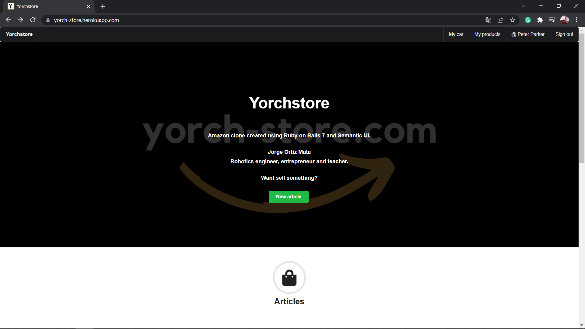
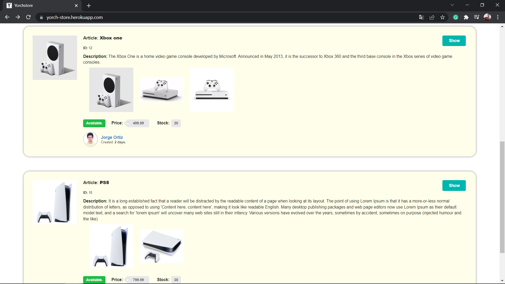
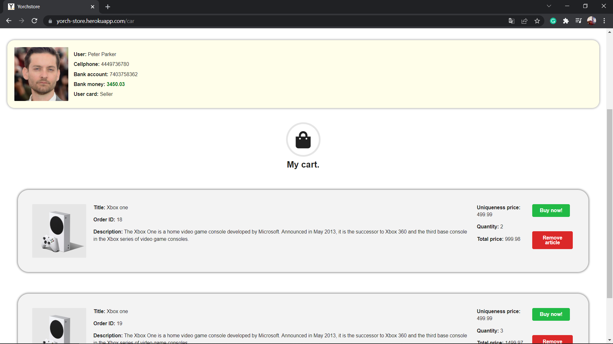

# Yorchstore (Amazon clone).

Yorchstore is an app created with Rails 7.

## App.

Heroku link: https://yorch-store.herokuapp.com/

## Description

This app was developed using Ruby on Rails.
In this app, you can sign in and sign up using your
Google account. Once you sign up and confirm your account, 
you will create your own profile and upload a profile photo. 
You will be able to create posts, comment posts and click 
in like button.

You will be able to sign up as a buyer or as a seller. 
Depending on the option, you can create or buy products.

All the updates in the website will occur instantaneously
using Hotwire.

Have a wonderful day! :smiley:
Greetings :love_you_gesture:

## Softwares and frameworks.

* Ruby: 3.0.1
* Ruby on Rails: 7.0.2
* Google Cloud Storage.
* Hotwire.
* Semanti UI.
* PostgreSQL.
* VSCode.
* Windows 10.

## Author:

* Jorge Ortiz Mata.
* San Luis Potosí S.L.P. México
* ortiz.mata.jorge@gmail.com
* +52 (444) 576 3034.

## Images.

-----

-----

